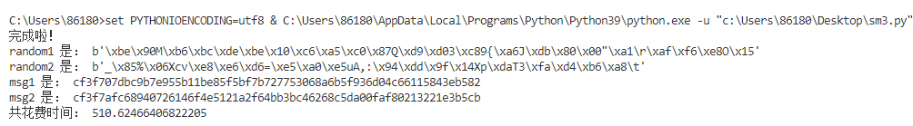
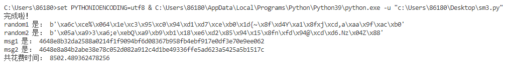

# Report1：

  本次写的是给的第一个项目，也就是对reduced-SM3的birthday-attack，在本次实验中，我所使用的SM3实现方式是Python语言和基于GmSSL国密库的实现，也就是我在第一周实验课所研读的内容，在暑假期间加以完善和整理。在实现过程中，因为在python中输出的接口是bytes类型，因此我选择将它转化为16进制数，然后逐渐加大比较的位数，来测试找到碰撞的效果，对于碰撞的两个数，每次随机生成即可。找到的最好结果是找到了48位的碰撞，以下展示了我所找到的40位碰撞和48位碰撞：其中random1和random2分别是找到的两个碰撞的bytes形式，每次随机生成，msg1和msg2分别是它们的hash形式，以16进制显示，观察msg1和msg2的前几位也可以看到确实找到了40bit和48bit的碰撞。（如果下图没有显示出来的话，可以到pics文件夹查看）

以上是找到的40位碰撞

以上是找到的48位碰撞

