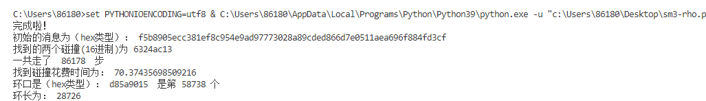
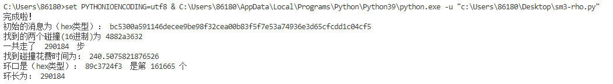
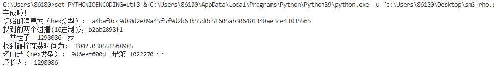
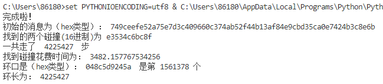

# Report2：

  本次实验完成的是对于reduced-SM3用rho-method进行碰撞攻击，和之前的相同，使用的SM3实现方式是Python语言和基于GmSSL国密库的实现。因为要使用SM3进行不停的哈希，所以在这个实验中具体流程应该是：初始一个消息，然后对这个消息hash一下，算出具体的hash值后，因为使用reduced-SM3，所以应选取前n位（这个n应该根据每次测试改变）。然后对这个结果再次hash，再次选取前n位，直到我们找到一个环为止。

  我使用的判断环的方法如下：规定两个变量msg1和msg2。msg1每次做一次hash截取，msg2做两次哈希两次截取，用index记录当前走过的步数。直到msg1和msg2相等时，说明出现了一个环，且index是环长的k倍，k为整数。

  然后要找到环口，也就是环开始的地方。此时保持msg2不变，规定msg3从开头开始走，msg1从当前位置开始走，直到他们两个相遇，此时的值即为环口的值。

  最后还要找环长，对于环长，只需要从上述环口位置，直到第一次走回环口，所经过的步数就是环长的值。

  以下展示了通过rho-method，我所找到的不同位数的hash碰撞（其中只放了64、72、80、88位的hash碰撞，对于小的位数效果相同），可以看到，在不同位数的条件下，对于每次随机生成的一个消息，都找到了碰撞，并且求出了环口，环长。可以发现，这个方法的效率比起naive的birthday-attack来说要高上一些。（如果下图没有显示出来的话，可以到pics文件夹查看）(如果您想测试代码的正确性的话，直接运行可能较慢，您可以将[0:11]替换成[0:1]、[0:2]、[0:3]或[0:4]，这样可以较为快速的得出碰撞8bit、16bit、32bit和64bit的结果)

以上是找到的64位碰撞

以上是找到的72位碰撞

以上是找到的80位碰撞

以上是找到的88位碰撞
