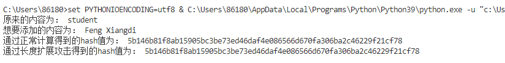

# Report3

  这个项目完成的是对于sm3的长度扩展攻击，和之前的相同，使用的SM3实现方式是Python语言和基于GmSSL国密库的实现。在这个项目中，我所做的就是，设置两个消息msg1和msg2。

  在模拟服务端时（在代码中显示为“通过正常计算得到的”），具体流程是：将msg1填充后，连接上msg2，然后一起进行hash，此时我们是直到msg1和msg2的值的。

  在模拟攻击端时，我们并不知道msg1的值，只知道msg1（填充后）的长度，这个很容易获得，因为padding模式都是相同的。还有msg1的hash值，根据MD结构的计算特性，通过改变IV的值，对msg2进行了针对性的填充，完成了长度拓展攻击。实验结果如下所示：（如果下图没有显示出来的话，可以到当前目录pics文件夹查看）

