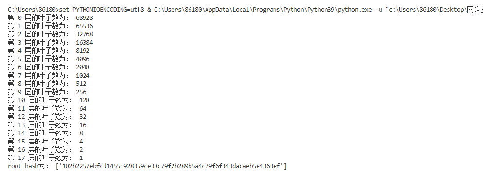
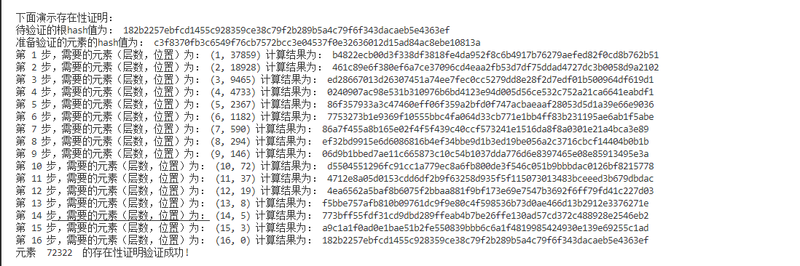
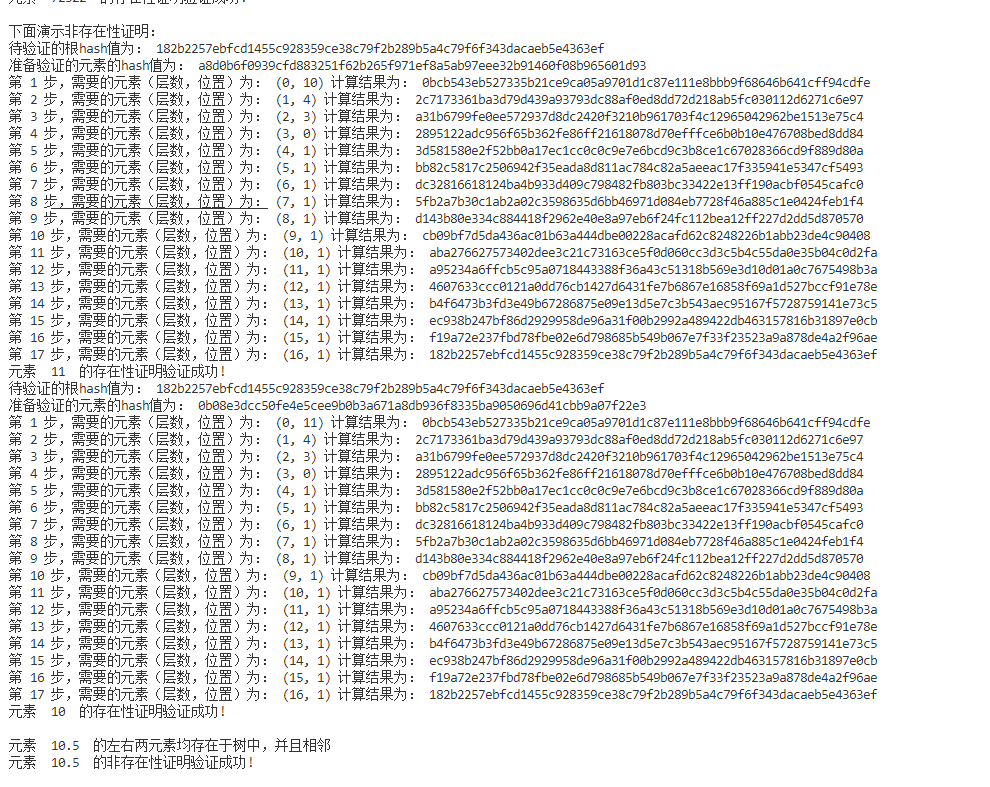

# report4

  在这个项目中，我根据RFC6962的标准构建了一个10w个叶子的merkle tree，包括了任意数量的叶子传入、叶子节点与非叶子节点连接上不同的数来加以区分等。并给出了存在性证明和非存在性证明。具体结果如下所示：

  首先，因为非存在性要求我们的节点以一定的数量排序，因此我们用0-99999作为我们每个叶子的初始值，按顺序建树并进行hash，最后结果如下图所示: 可以看到，对于10w叶子的一棵树，一共有18层，每一层的结构（从左到右叶子依次排列）如下所示：（如果下图没有显示出来的话，可以到当前目录pics文件夹查看）

  关于存在性证明，要做的就是每次找它的兄弟节点，然后在前面连接上01进行hash，最后验证根节点的hash值是否相同，可以看到，对于随机选择的一个数，正常运行：（如果下图没有显示出来的话，可以到当前目录pics文件夹查看）

 关于非存在性证明，要做的就是找到和它最近的两个元素，验证他们的存在性和是否相邻，如果这两个条件都满足，那么就验证了非存在性。可以看到，对于输入的元素10.5，我们分别验证了10 和 11 的存在性，并判断这两个元素是相邻的叶子节点，因此10.5不存在于这棵树中，非存在性验证成功。（如果下图没有显示出来的话，可以到当前目录pics文件夹查看）

