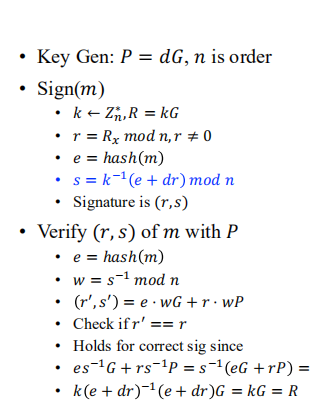
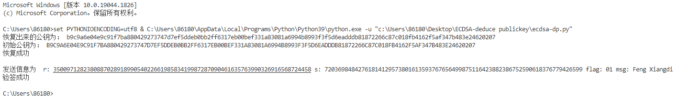

# Report

 这个项目完成的是想办法推断出一个公钥，并且用到尽可能少的信息。

在算法层面，采用的是由优化后的SM2类修改而成的ECDSA算法，采用了SM2类中的一些点乘，点加运算等，同时实现了ECDSA的签名和验签，ECDSA的具体原理过程如下图所示：

因为要推断公钥信息，因为如果知道（r，s）和e，另外还知道之前的随机数k，就可以算出公钥：
$$
d_a=r^{-1}(s k-e) \bmod n
$$
根据这个等式，如果我们想知道公钥的话，代入得：
$$
\mathrm{Q_a}=\mathrm{d_a G}=\mathrm{r}^{-1}(\mathrm{sk}-\mathrm{e}) \cdot \mathrm{G}=\mathrm{r}^{-1}(\mathrm{~s} \cdot \mathrm{kG}-\mathrm{eG})=\mathrm{r}^{-1}(\mathrm{sK}-\mathrm{eG})
$$
可以发现，点K的坐标是关键，只要能知道点K的坐标x1,y1。已知
$$
r=x1\bmod n,n<p<2n
$$
因此，x1一共有两种可能 ：x1=r 或 x1 =r+n 所以在这里我们要花1bit的信息来告诉推断公钥的函数x1的取值

同时，对于一个确定的x1，y1也有正负两种可能，在模p的背景下，因为p是奇数，所以可以通过y1的奇偶性来判断y1的值，如果y1和计算出来的y1’奇偶性不符，那么y1=p-y1。

综上所示，有了这两个信息，我们就能推断出公钥的值

同时，在恢复公钥的时候，我们还需要用到费马小定理：
$$
y^p\equiv y\bmod p \rightarrow y^{p+1}\equiv y^2\bmod p
$$
设
$$
Y=y^2 \bmod p
$$
则有：
$$
\mathrm{Y}^{\frac{\mathrm{p}+1}{2}} \equiv \mathrm{Y} \quad(\bmod \mathrm{p}) \Rightarrow \mathrm{y}=\pm\mathrm{Y}^{\frac{\mathrm{p}+1}{4}} \bmod \mathrm{p}
$$
综上，我们可以设置一个2bit的flag来确定公钥具体的值，因此需要多添加2bit的信息，具体的执行结果如下所示，可以看到，成功恢复了公钥，完成了验签过程：

