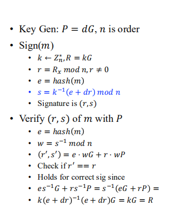
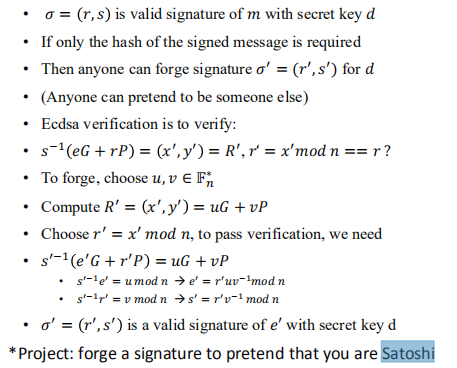
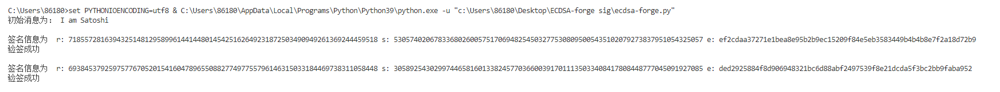

# Report

 这个项目完成的生成一个签名值假装我是中本聪，但是由于一直找不到相应的签名值，因此在本项目中就自己生成一个：

在算法层面，采用的是由优化后的SM2类修改而成的ECDSA算法，采用了SM2类中的一些点乘，点加运算等，同时实现了ECDSA的签名和验签，ECDSA的具体原理过程如下图所示：

因此，要假装是别人，就要用不同的明文和签名值，顺利通过验签，伪造的原理如下图所示：

可以看到最后的执行结果，伪造成功！e是明文的hash值，r和s是签名信息，两次签名的签名信息不同，e也不同，但是都能通过验签。

