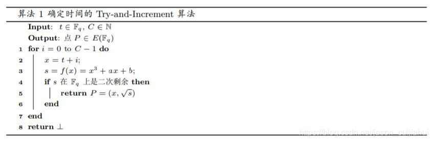
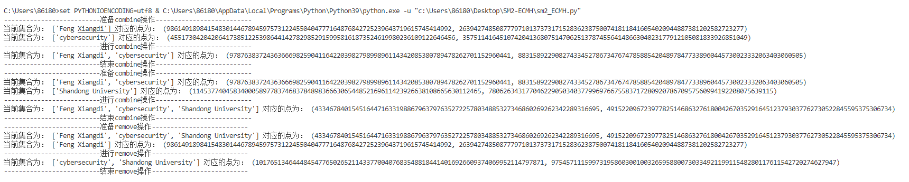

# Report

在本项目中，实现了一个朴素的ECMH策略，要实现一个ECMH策略，最基本的就是实现hash列表的交换性，结合性等：如hash（{a}）+hash（{b}）=hash（{b}）+hash（{a}）=hash（{a，b}）因此，如何把hash的消息映射到椭圆曲线的点上是重中之重，在这里我使用了一种比较朴素的方法：

其中t是消息的hash值（在这里采用sha256的方法）C是自己取的值，我取为n

判断是否是二次剩余的方法在这里我是用欧拉定理，即判断
$$
a^{\frac{p-1}{2}}=1
$$
使用s计算y的算法为：
$$
\mathrm{y}=\mathrm{s}^{\frac{\mathrm{p}+1}{4}} \bmod \mathrm{p}
$$
因此我们就可以定义combine 和 remove操作分别为点加和点减，可以结合SM2类中相关算法加以实现，具体结果如下所示：

