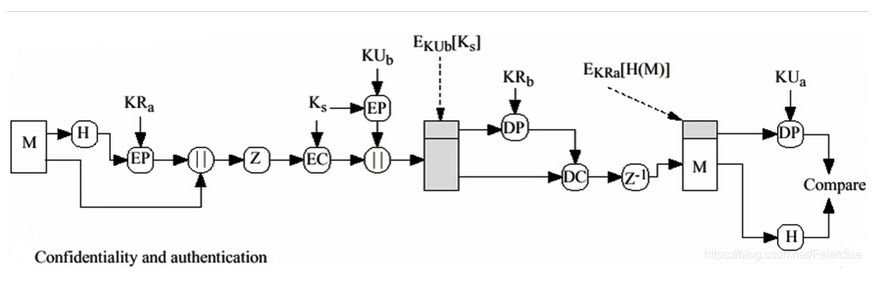
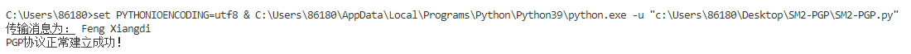

# Report

  这个项目完成的是将SM2运用到PGP系统中，代替传统的RSA公钥加密，PGP系统的原理如下图所示：

  在这个项目中，我们分别用两个函数模拟了Alice和Bob的行为

  其中，发送者为Alice（简称A），接收者为Bob（简称B），发送者有3个密钥，A 的私钥、B 的公钥 和 A 生成的一次性会话密钥。

  接收方B 有两个密钥：B 的私钥和 A 的公钥。

* 首先从A开始
* 采用hash函数，形成数据摘要H（m）
* 用A的私钥（SM2）对数据摘要进行签名，得到MAC，然后和消息m连接
* 用A产生的一次性会话密钥（AES）加密连接后的消息，用B的公钥加密会话密钥
* B收到邮件
* 先用自己的私钥解密得到一次性会话密钥
* 再用一次性会话密钥解密得到连接后的消息
* 对于MAC，用A的公钥验签，若成立，则完成了一次成功的会话

实验结果如下所示，可以看到，会话成功：

