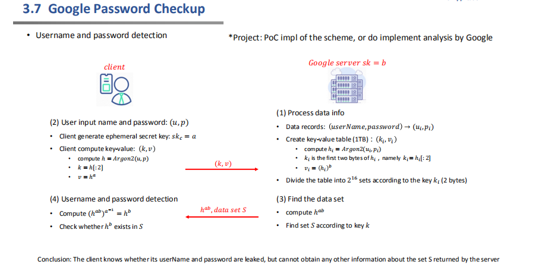
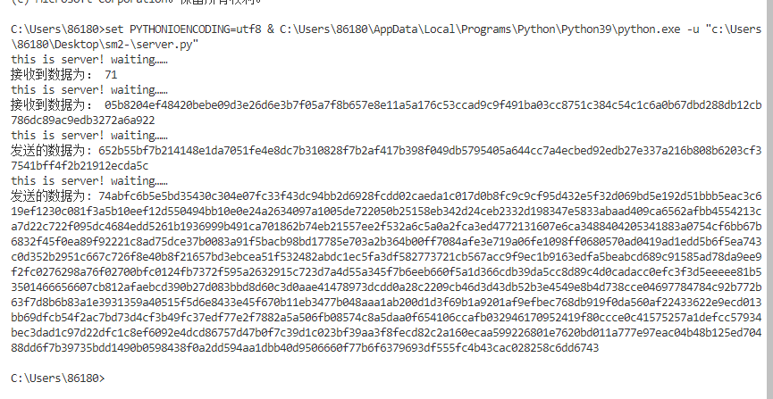
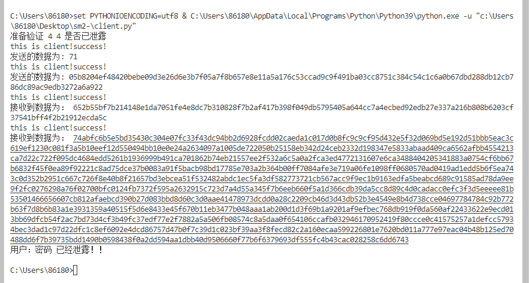

# Report

本项目实现了一个简单的PoC scheme，通过网络通信，模拟了server和client的交换，因为只是一个朴素的实现，所以在这里并没有很大的数据量，仅使用了100条数据，每10条数据分成一组，一共10组，并且采用一种最简单的递补法来将hash值映射到椭圆曲线上。在本项目中，使用的hash为sha-256，使用的加密方案为Gmssl库中的sm2。原理如下所示：

实验结果如下所示，可以看到，对于客户端输入的”用户名：密码“为”4：4“的组合，因为我们在服务端存储的格式为"str(i)：str(i)"，所以应该会显示泄露，成功完成策略复现。

