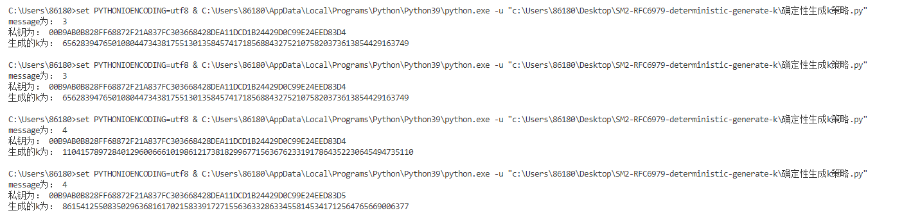
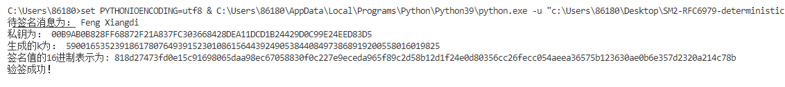

# Report

  在这个项目中任务是完成rfc6979中描述的确定性生成k的做法，其中在”确定性生成k策略.py“ 文件中，展示了该策略的正确性，可以看到，如果message和私钥不变，那么就不会改变，如果其中任何一个数改变，生成地伪随机数也会改变，如下图所示：

  而在"确定性生成k在sm2中的运用.py"文件中，使用的是自己优化后的SM2类，并且将这个确定性生成k的策略封装进去，使其能被正确调用，最后在代码结尾尝试加密了字符串，发现可以验签通过，说明成功地封装进了SM2中

