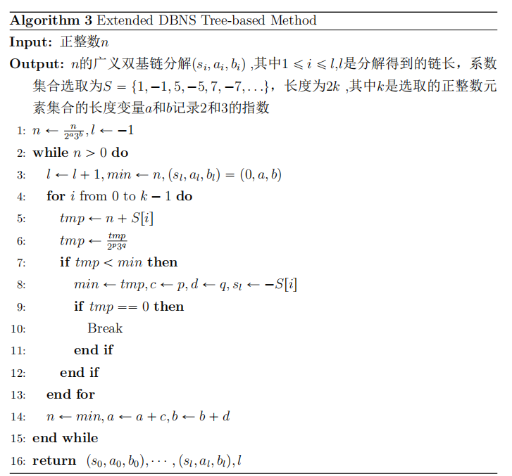
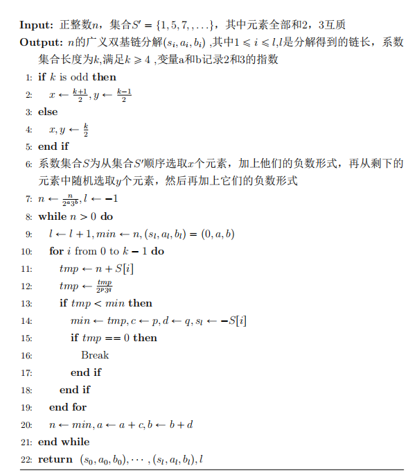
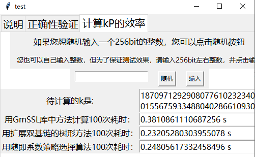
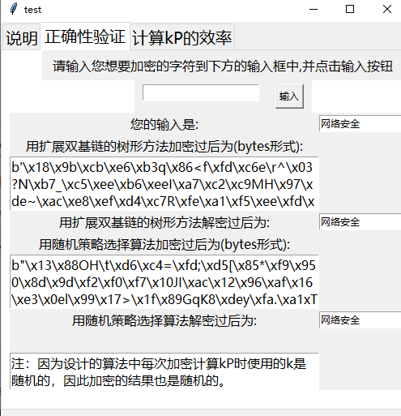

# Report

本项目完成的是对于SM2的整体优化，主要从椭圆曲线点乘优化的角度，相较于Gmssl中使用的朴素的二进制法，效率提升大概在30%左右。

总体贯彻那空间换时间的思想，通过一系列的预计算，来减小真正执行过程中的计算量，减小点乘的使用次数。

在本项目中一共实现了两种算法：

#### 1.扩展双基链的树形方法

  使用树型方法在分解双基链时不需要额外的存储空间，而且分解得到的双基链链长较好。因此可以把得到双基链的树型分解方法拓展成适合于得到扩展双基链的树型算法。和树型算法一样，该算法不断的进行约化、加减系数和比较的循环，直到分解完成为止，在加减系数的一步有所变化，不再是进行+1或者-1，而是加上或减去和2，3都互素的数。对于扩展双基链的树形方法，如下述算法表示：

#### 2.扩展双基链的随机系数选择树形方法

  使用树形方法，如果我们采取固定的系数策略，那么对于一个数的链长也是固定的，尽管双基链在很大程度上不像二进制NAF那样容易受到侧信道攻击，所以在某些特殊场合，使用随即系数的办法可以让同一个数分解的链长发生变化，从而很大限度的防止了侧信道攻击的出现，并且对效率影响很小：

为了方便体现优化程度，我设计了一个建议的ui界面，直接运行代码即可以看到，相较于Gmssl库中原来的算法，提升效率大概在30%到40%

另外，也能看到正确性验证的结果：

