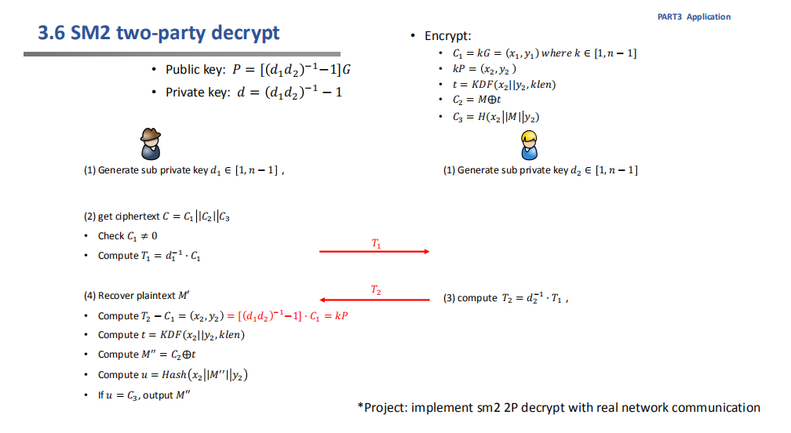
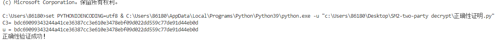
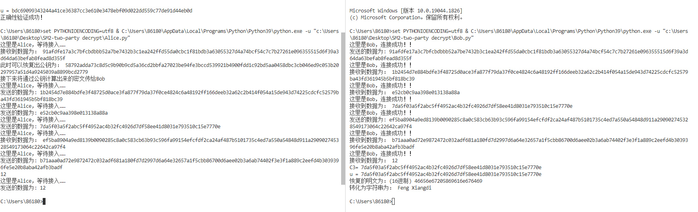

# Report

  本项目实现的是SM2-two party decrpt ,采用的SM2为Gmssl库中的实现方式，实验原理如下所示：

在上图中还缺步骤，和之前的sign方案相同，通过d1，d2，协商出公钥，然后由右边的Alice 发给左边的Bob

采用的网络通信方式为python 中的socket套接字，采用tcp协议完成，关于策略实现的正确性如下所示：

随后网络通信的结果如下所示，可以看到通信成功建立，并且完成了解密

