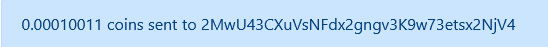
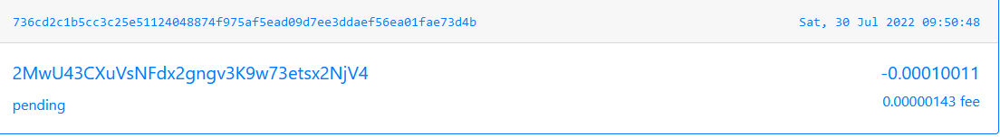
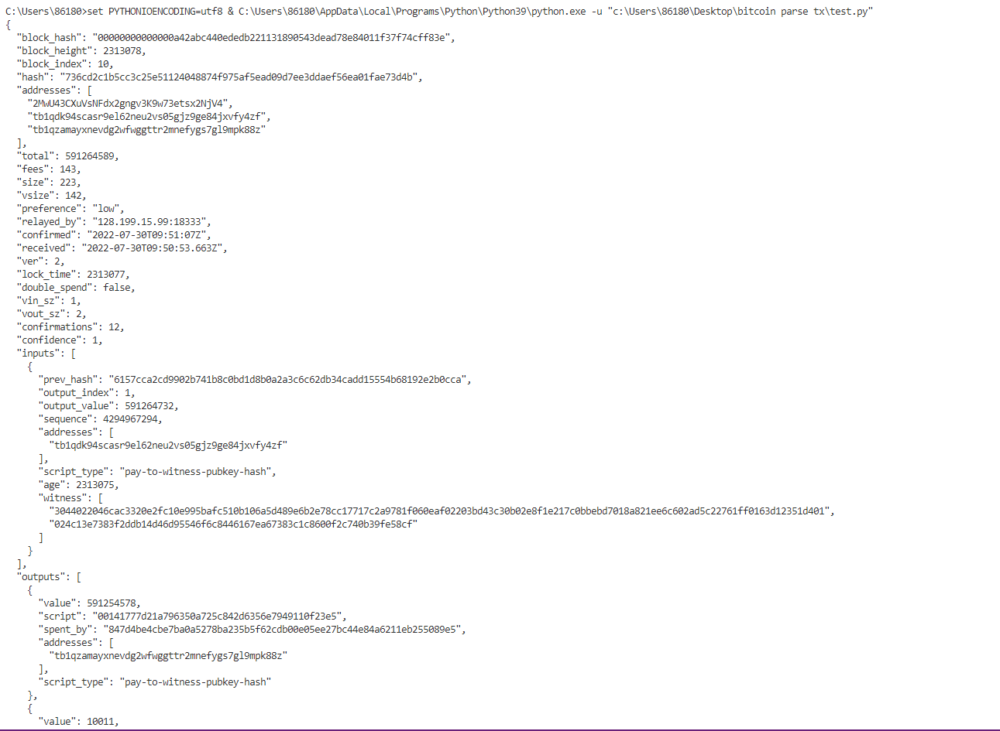

# Report

 这个项目完成的是自己编写脚本，向相关网站发送tx来获得关于txdata的解析。

具体的代码十分简单，但我们首先要获得一个tx：

* 从Bitcoin Testnet Faucet 中执行一个关于测试币的交易，如下所示

* 然后就能看到这个交易的具体信息，也就是拿到了tx值，

* 随后就可以编写脚本，在这里选择用blockcypher的api接口，把结果输出在result文件中,完成！

